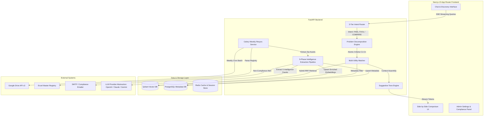

# RankUno 1Stop Solution — Technical Investigation & Systems Architecture Report

**Document Version:** 1.0.0  
**Target Platform:** RankUno 1Stop Solution  
**Author:** Principal AI Systems Architect & Lead Software Engineer  
**Date:** September 2026  

---

## 1. Executive Summary

This investigation report provides an end-to-end technical blueprint for the **RankUno 1Stop Solution**, an AI-powered utility discovery and pair-engineering platform designed for internal RankUno teams. The platform bridges the gap between scattered, undocumented internal code assets and engineers seeking solutions to technical problems.

### Key Innovations Investigated & Designed:
1. **Problem Decomposition & Atomic Criteria Engine:** Decomposes natural language queries into categorized, prioritized requirement pills ($C_1, C_2, \dots$).
2. **Multi-Utility Comparative Matrix:** Side-by-side evaluation of matching tools with granular criteria badges (✅ Fully Met, 🟡 Partially Met, ❌ Not Met, 🔧 Adaptable).
3. **Always-Suggestive Tone Directive:** Hardened system prompts and post-processing filters guaranteeing a non-prescriptive, collaborative assistant persona.
4. **Weekly Drive Batch Resync & Excel Master Registry:** Scheduled cron pipeline scanning Google Drive zip files and a centralized Excel spreadsheet for documentation compliance.
5. **5-Phase AI Intelligence Extraction Engine:** Automated LLM enrichment pipeline generating structured utility intelligence (Capability Maps, Tech Fingerprints, Adaptability Assessments) stored in Qdrant vector database payload and PostgreSQL metadata store.

---

## 2. Complete System Architecture Overview



---

## 3. Deep-Dive Subsystem Specifications

### 3.1 3-Tier Multi-Turn Intent Routing Engine

Multi-turn chat applications frequently fail due to pronoun coreference ("*How do I run it?*"), context shifts, or ambiguous prompts. We employ a 3-tier routing architecture:

```
User Query ---> [Tier 0: Contextual Query Rewriter]
                     |
                     v (Disambiguated Query)
                [Tier 1: Embedding Semantic Router] --(<10ms match)--> [Fast FAQ / Greeting Handler]
                     |
                     v (Unmatched)
                [Tier 2: Structured Output Classifier (LLM)] ---> [Target Pipeline Execution]
```

* **Tier 0 — Contextual Query Rewriter:** Resolves ambiguous references. If a user asks *"Can it process CSV?"* following a prompt about `DataTransformer`, the rewriter outputs: *"Can DataTransformer process CSV files?"*
* **Tier 1 — Fast Semantic Router (`semantic-router`):** Evaluates query against pre-computed prototype vectors for deterministic intents (e.g., greetings, platform help) in $< 10$ ms without consuming LLM generation tokens.
* **Tier 2 — Structured Output Classifier (LLM Function Calling):** Classifies complex intents into:
  * `FIND_TOOL`: Discover matching internal utilities.
  * `COMPARE_TOOLS`: Explicit comparison between two or more named tools.
  * `HOW_TO_USE`: Generate step-by-step installation and execution walkthrough.
  * `GAP_ANALYSIS`: Assess modifications required for partial matches.
  * `GENERAL_QUESTION`: Technical query routed to web search fallback.

---

### 3.2 Problem Decomposition & Atomic Criteria Formulation

When a user submits a problem statement, the **Problem Decomposition Engine** decomposes it into atomic, evaluatable criteria $C = \{c_1, c_2, \dots, c_n\}$.

#### Mathematical Formulation:
Given a problem prompt $P$, the decomposition function $f_{decomp}(P)$ yields:
$$C = f_{decomp}(P) = \{ (id_i, desc_i, cat_i, prio_i, kw_i) \}_{i=1}^n$$

Where:
* $cat_i \in \{ \text{FUNCTIONAL}, \text{INPUT\_FORMAT}, \text{OUTPUT\_FORMAT}, \text{TECH\_STACK}, \text{INTEGRATION}, \text{PERFORMANCE}, \text{DEPLOYMENT} \}$
* $prio_i \in \{ \text{MUST\_HAVE}, \text{NICE\_TO\_HAVE}, \text{FLEXIBLE} \}$

#### Python Pydantic Model Schema:
```python
from pydantic import BaseModel, Field
from typing import Literal, List, Optional

class Criterion(BaseModel):
    id: str = Field(description="Unique criterion code, e.g., C1, C2")
    description: str = Field(description="Granular requirement text")
    category: Literal[
        "FUNCTIONAL", "INPUT_FORMAT", "OUTPUT_FORMAT", 
        "TECH_STACK", "INTEGRATION", "PERFORMANCE", "DEPLOYMENT"
    ]
    priority: Literal["MUST_HAVE", "NICE_TO_HAVE", "FLEXIBLE"]
    keywords: List[str]

class ProblemDecomposition(BaseModel):
    original_statement: str
    domain: str
    inferred_tech_context: List[str]
    criteria: List[Criterion]
```

---

### 3.3 Multi-Utility Matching Matrix & Comparative UI

When $m \ge 2$ candidate utilities are retrieved from Qdrant, each utility $U_j$ ($j = 1 \dots m$) is evaluated against every criterion $c_i$.

#### Matching Status Matrix:
For each pair $(c_i, U_j)$, the engine assigns a status $S_{i,j} \in \{ \text{FULLY\_MET}, \text{PARTIALLY\_MET}, \text{NOT\_MET}, \text{ADAPTABLE} \}$.

$$\text{Overall Match Score}(U_j) = \frac{\sum_{i=1}^n w(prio_i) \cdot s(S_{i,j})}{\sum_{i=1}^n w(prio_i)}$$

Where weights are defined as:
* $w(\text{MUST\_HAVE}) = 1.0$, $w(\text{NICE\_TO\_HAVE}) = 0.5$, $w(\text{FLEXIBLE}) = 0.2$
* Status scores: $s(\text{FULLY\_MET}) = 1.0$, $s(\text{ADAPTABLE}) = 0.75$, $s(\text{PARTIALLY\_MET}) = 0.5$, $s(\text{NOT\_MET}) = 0.0$

#### Side-by-Side Wireframe Data Component:
```
+----------------------------------------------------------------------------------+
|  PROBLEM DECOMPOSITION PILLS                                                     |
|  ● [C1] Bulk Excel Processing (MUST_HAVE)   ● [C2] JSON Schema Validation (MUST) |
|  ● [C3] MongoDB Push (MUST_HAVE)             ● [C4] Python Language (NICE)       |
+----------------------------------------------------------------------------------+
|  COMPARISON MATRIX                                                               |
|  +-------------------------------------+--------------------------------------+  |
|  | Utility: DataTransformer            | Utility: ExcelPipeline               |  |
|  | Match Score: 83%                    | Match Score: 67%                     |  |
|  | Tech: Python, FastAPI               | Tech: Node.js, Express               |  |
|  +-------------------------------------+--------------------------------------+  |
|  | C1: ✅ Fully Met                    | C1: ✅ Fully Met                     |  |
|  | C2: 🟡 Partially Met (Basic checks) | C2: ❌ Not Met                       |  |
|  | C3: ✅ Fully Met                    | C3: 🔧 Adaptable (Needs connector)   |  |
|  | C4: ✅ Fully Met                    | C4: ❌ Not Met (Node.js)             |  |
|  +-------------------------------------+--------------------------------------+  |
|  | [View Walkthrough]  [Adaptation]    | [View Walkthrough]  [Adaptation]     |  |
+----------------------------------------------------------------------------------+
```

---

### 3.4 Suggestive Tone Engine

To eliminate rigid, commanding bot responses, the platform integrates a **Suggestive Tone Directive** at the system prompt level and enforces it with regex heuristics.

#### Directive Transformation Matrix:
| ❌ Prohibited Directive Phrasing | ✅ Mandatory Suggestive Transformation |
| :--- | :--- |
| *"You must use DataTransformer."* | *"DataTransformer could be a great fit for your setup."* |
| *"You need to install MongoDB drivers."* | *"It might be helpful to set up MongoDB drivers as a first step."* |
| *"This tool won't work for your case."* | *"This utility covers the core inputs well, though you might want to adapt the output module."* |
| *"Execute command X to start."* | *"One option to kick things off is running command X."* |
| *"You should rewrite the validator."* | *"You may find it beneficial to extend the validation logic."* |

#### Enforcement System Prompt Fragment:
```text
SYSTEM DIRECTIVE: ALWAYS-SUGGESTIVE PERSONA
You are a collaborative pair-engineering assistant for RankUno engineers.
1. NEVER order, direct, or instruct the user authoritatively.
2. Frame all recommendations using suggestive phrases: "you might consider", 
   "one approach that could work well", "it might be worth exploring", "you may find it helpful to".
3. Frame gaps as creative adaptation opportunities rather than tool failures.
4. When comparing utilities, present all candidates objectively, highlighting the unique strengths of each.
```

---

### 3.5 Weekly Resync, Excel Registry & Compliance Scanner

To keep the platform synchronized with Google Drive without overwhelming server resources, a **weekly batch cron process** (executed via Celery Beat) executes the scanning pipeline:

```
+--------------------------------------------------------------------------+
|  WEEKLY BATCH RESYNC PIPELINE                                            |
|                                                                          |
|  Step 1: Fetch Google Drive Change Delta (startPageToken)                |
|  Step 2: Read Excel Master Registry ("Utilities_Master.xlsx")            |
|          -> Check Mandatory Columns: Name, Owner, Email, Problem,        |
|             Tech Stack, Zip Link, Status, Last Updated.                  |
|  Step 3: Extract Utility Zip Archives                                    |
|          -> Inspect Zip Structure against Configurable Checklist Rules:  |
|             - README.md / README.txt                                     |
|             - PROBLEM_STATEMENT.md                                       |
|             - INSTALL.md / SETUP.md                                      |
|             - Conditional Rules (API Docs if tech_stack has API)         |
|  Step 4: Generate Compliance Report & Score                              |
|          -> If Score < 100%, Trigger Suggestive Compliance Email Alert   |
|  Step 5: Pass Compliant Assets to 5-Phase Intelligence Pipeline          |
+--------------------------------------------------------------------------+
```

#### Automated Suggestive Compliance Email Template:
```text
Subject: 📋 RankUno 1Stop Solution — Quick documentation check for "{utility_name}"

Hi {owner_name},

During our weekly catalog sync, we noticed a few items that could make your 
utility "{utility_name}" even easier for colleagues to discover and use:

📦 Zip Archive Recommendations:
  • README.md — Adding setup instructions would help team members get started quickly.
  • INSTALL.md — Step-by-step setup guidance would be super helpful.

📊 Excel Registry Highlights:
  • Problem Statement — Including a brief problem statement helps our search engine match your tool to user queries.

Your utility is currently at {compliance_score}% documentation completeness! 
Adding these items will ensure your work gets maximum visibility across RankUno.

Warm regards,
RankUno 1Stop Solution Team
```

---

### 3.6 5-Phase AI Intelligence Extraction Pipeline

For compliant utility uploads, the **Intelligence Extraction Pipeline** runs five LLM scans to build deep context before upserting into the vector database:

```
+-----------------------------------------------------------------------------------+
| 5-PHASE INTELLIGENCE EXTRACTION                                                   |
+-----------------------------------------------------------------------------------+
| Phase 1: Problem Context Scan    --> Extracts core problem, persona, triggers      |
| Phase 2: Capability Mapping      --> Generates bulleted CAN / CANNOT matrices     |
| Phase 3: Tech Fingerprint        --> Auto-detects languages, frameworks, APIs      |
| Phase 4: Integration Discovery   --> Identifies data sources, sinks, webhooks     |
| Phase 5: Adaptability Assessment --> Rates modularity & effort (LOW/MED/HIGH)   |
+-----------------------------------------------------------------------------------+
```

These extracted intelligence facets are saved into Qdrant vector payloads and PostgreSQL tables, facilitating high-precision vector and metadata filtering.

---

## 4. Technology Stack & Database Schemas

### 4.1 Recommended Tech Stack

| Component | Technology Selected | Rationale |
| :--- | :--- | :--- |
| **Frontend** | Next.js 15 (App Router, TypeScript, Tailwind CSS, shadcn/ui) | Modern, fast rendering with SSE streaming support for real-time responses |
| **Backend API** | FastAPI (Python 3.11+) | Asynchronous performance, native Pydantic validation, seamless SSE streaming |
| **Task Scheduler** | Celery + Redis | Handles weekly batch sync jobs, background email processing, and vector ingestion |
| **Vector DB** | Qdrant | Dense & sparse vector search with HNSW payload filtering and native RRF fusion |
| **Relational DB** | PostgreSQL 16 | Stores structured metadata, user accounts, compliance logs, and sync status |
| **Cache** | Redis 7 | Session caching, prompt caching, and SSE message buffering |
| **Search Engine** | Qdrant Hybrid Search (Dense + Sparse BM25) + Cohere Rerank v3.5 | Combines semantic vector similarity with exact keyword precision |

---

### 4.2 Database Schemas

#### PostgreSQL Schema (`schema.sql`):
```sql
-- Core Utilities Table
CREATE TABLE utilities (
    id UUID PRIMARY KEY DEFAULT gen_random_uuid(),
    name VARCHAR(255) NOT NULL,
    owner_name VARCHAR(255) NOT NULL,
    owner_email VARCHAR(255) NOT NULL,
    drive_file_id VARCHAR(255) UNIQUE NOT NULL,
    problem_statement TEXT NOT NULL,
    tech_stack TEXT[] NOT NULL,
    status VARCHAR(50) DEFAULT 'ACTIVE',
    compliance_score NUMERIC(5,2) DEFAULT 0.0,
    created_at TIMESTAMP WITH TIME ZONE DEFAULT CURRENT_TIMESTAMP,
    updated_at TIMESTAMP WITH TIME ZONE DEFAULT CURRENT_TIMESTAMP
);

-- Compliance Scan Logs Table
CREATE TABLE compliance_logs (
    id UUID PRIMARY KEY DEFAULT gen_random_uuid(),
    utility_id UUID REFERENCES utilities(id) ON DELETE CASCADE,
    scan_timestamp TIMESTAMP WITH TIME ZONE DEFAULT CURRENT_TIMESTAMP,
    missing_zip_files JSONB NOT NULL DEFAULT '[]',
    missing_excel_fields JSONB NOT NULL DEFAULT '[]',
    alert_sent BOOLEAN DEFAULT FALSE,
    compliance_status VARCHAR(50) NOT NULL
);

-- Extracted Intelligence Store Table
CREATE TABLE utility_intelligence (
    id UUID PRIMARY KEY DEFAULT gen_random_uuid(),
    utility_id UUID UNIQUE REFERENCES utilities(id) ON DELETE CASCADE,
    problem_context JSONB NOT NULL,
    capability_map JSONB NOT NULL,
    tech_fingerprint JSONB NOT NULL,
    integration_points JSONB NOT NULL,
    adaptability_assessment JSONB NOT NULL,
    last_enriched_at TIMESTAMP WITH TIME ZONE DEFAULT CURRENT_TIMESTAMP
);
```

#### Qdrant Collection Payload Schema:
```json
{
  "utility_id": "9b1deb4d-3b7d-4bad-9bdd-2b0d7b3dcb6d",
  "utility_name": "DataTransformer",
  "chunk_type": "PROBLEM_CONTEXT",
  "content": "DataTransformer processes bulk Excel sheets and converts them to validated JSON...",
  "tech_stack": ["Python", "FastAPI", "MongoDB"],
  "allowed_readers": ["domain:rankuno.com"],
  "capability_tags": ["excel-processing", "json-conversion", "mongodb-insert"],
  "adaptability_score": "MEDIUM"
}
```

---

## 5. Deployment, Capacity & Model Abstraction Strategy

### 5.1 Infrastructure Sizing for RankUno Scope
* **Current Footprint:** ~50 active employees, $\le 100$ internal utilities.
* **Hosting Model:** Single-server containerized deployment using Docker Compose.
* **Resource Allocations:**
  * **App / API Server:** 4 vCPU, 8 GB RAM
  * **Qdrant Vector DB:** 2 vCPU, 4 GB RAM (handles 100 tools $\approx 10,000$ vector chunks comfortably in RAM)
  * **PostgreSQL + Redis:** 2 vCPU, 4 GB RAM

### 5.2 Dual-Model Abstraction Layer
To balance cost and accuracy, the system implements a unified Model Abstraction Layer (`LLMProvider` interface):

```
                     +----------------------------------+
                     |  LLM Provider Abstraction Layer  |
                     +----------------------------------+
                                      |
              +-----------------------+-----------------------+
              |                                               |
              v                                               v
    [Development / Testing]                        [Production Launch]
   • OpenAI GPT-4o-mini                           • Anthropic Claude Sonnet 3.5
   • Google Gemini 1.5 Flash                      • OpenAI GPT-4o
```

Switching models requires changing an environment variable (`LLM_PROVIDER=CLAUDE_SONNET`) without modifying core application code.

---

## 6. Implementation Verification Plan

| Phase | Focus Area | Verification Method | Target SLA / Goal |
| :--- | :--- | :--- | :--- |
| **Phase 1** | Intent & Decomposition | Unit test Pydantic criteria parser on 20 sample queries | 100% valid schema generation |
| **Phase 2** | Multi-Utility UI | Cypress / Playwright E2E rendering of comparison matrix | Side-by-side view rendered in $<1.5$s |
| **Phase 3** | Suggestive Tone | Heuristic regex evaluation of LLM response outputs | 0 directive violations in 100 test runs |
| **Phase 4** | Drive Sync & Scanner | Mock Excel & Zip compliance test runner | 100% detection of missing required docs |
| **Phase 5** | System Latency | SSE streaming load test under 50 concurrent users | First token delivered in $<500$ ms |
