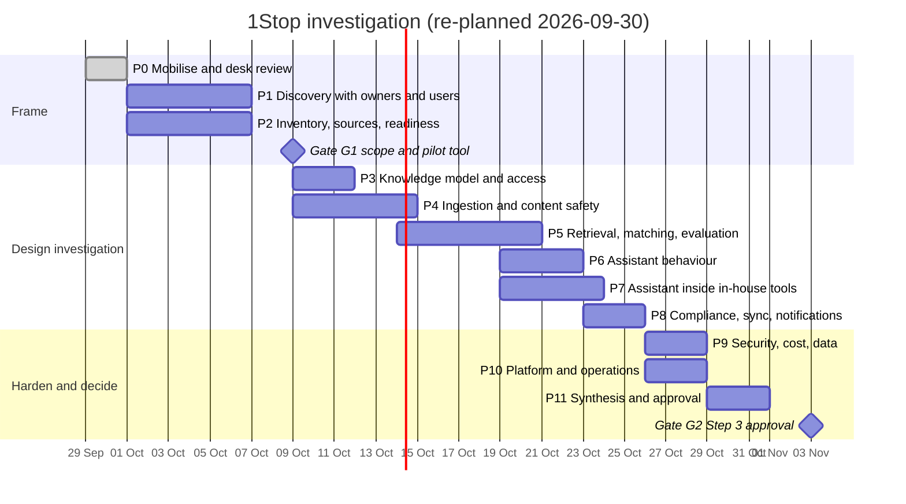

# RankUno 1Stop — Phase-by-Phase Investigation Plan

| | |
| :-- | :-- |
| **Document ID** | `RKN-1STOP-PLAN-V1` |
| **Version** | 1.1 (re-planned 2026-09-30 after owner answers) |
| **Status** | Phase 0 complete. Phase 1 next. |
| **Owner and approver** | AI Lead (approves all gates during testing) |
| **SDLC position** | This plan *is* Step 1 (Investigation). It ends at the Step 3 HITL gate (Phase 11). No production code before that gate; throwaway spike code is allowed and is archived. |

---

## 0. What changed in this version

| Owner answer (2026-09-30) | Effect on the plan |
| :-- | :-- |
| Internal first | No external-customer work. Phases 3, 7 and 9 are shorter. |
| The assistant is embedded in **in-house tools** (several in development), using all their docs with hybrid RAG | Phase 7 targets RankUno tools (RAE, prompt-engine, …). Phase 1 interviews tool owners and tool users instead of SaaS customers. |
| Registry in Google Drive; testing on Gmail; Entra ID later | Drive spike simplified (service account shared on the folder). Staff sign-in is simple during testing; Entra ID is planned for the rollout release. |
| Owner approves everything | Gates G1 and G2 are the owner's own sign-off, recorded in writing. |
| Minimum spend | Spike budget cut from ~$120 to **≤ $15**. Free and local options are tested first everywhere (D-28). |

**New total: about 5–6 weeks** (previously 7–8).

---

## 1. How the plan works

### 1.1 Structure of each phase

Each phase has an **objective**, **key questions**, **workstreams** (checklists), **spikes** (time-boxed experiments with pass/fail criteria, see §4), **deliverables**, an **exit gate**, and **feeds** (the decisions, risks and questions it resolves). A phase may end in "no-go"; that is a valid outcome.

### 1.2 ID conventions

| Prefix | Meaning | Lives in |
| :-- | :-- | :-- |
| F-nn | Finding | [INVESTIGATION_REPORT.md](../../INVESTIGATION_REPORT.md) §3 |
| A-nn | Assumption | [PROBLEM_STATEMENT.md](../../PROBLEM_STATEMENT.md) §8 |
| D-nn | Decision | [DECISION_LOG.md](DECISION_LOG.md) |
| R-nn | Risk | [RISK_REGISTER.md](RISK_REGISTER.md) |
| Q-xnn | Open question | [OPEN_QUESTIONS.md](OPEN_QUESTIONS.md) |
| S-nn | Spike | This document §4 |
| Pn.m | Workstream m of phase n | This document |

### 1.3 Working rules

1. **Evidence over opinion.** A decision moves to DECIDED with evidence attached, or with the owner's explicit call.
2. **Real data, safely.** Spikes use real RankUno repos only after the secret scan (S-03) clears them. Nothing from `project-standards/docs` is ingested until R-18 is fixed.
3. **Free first.** Every spike tries the free/local option first. A paid call needs a reason and runs under a `CostLedger` ceiling (total ≤ $15).
4. **No internal content to training-enabled tiers.** Check and record each LLM tier's data-use terms before sending real docs (R-24).
5. **Spike code is disposable.** It lives in `spikes/` and is never imported by product code.
6. **Update docs the same day.** When a finding changes a decision or risk, update the log that day.
7. **Weekly self-review.** The AI Lead records, in `docs/investigation/WEEKLY_LOG.md`: what changed, which decisions moved, what's blocked. With one approver, a written trail is the substitute for a second reviewer (R-20).

### 1.4 Roles

| Role | Who | Involvement |
| :-- | :-- | :-- |
| AI Lead | Investigator, builder **and approver** | All phases; Gates G1/G2 |
| Tool owners (5–8) | Owners of RAE, prompt-engine, newsletter, loc-intel, the tools in development | Interviews, card review, authoritative-doc lists, golden-set labels |
| Tool users / seekers (6–10) | Staff who use those tools or need tools | Interviews, task tests, golden-set questions |
| Pilot host tool owner | Q-T01 | Widget pilot (Phase 7) |

---

## 2. Timeline overview

Estimates assume one AI Lead at ~70% time.

**Fast track (about 3 weeks):** P0 → P1-lite (3 owners, 3 users) + P2 → P4 (S-03, S-04) → P5 (S-05, S-06) → P7 (S-09) → P11. Anything skipped is listed as a residual risk.

---

## 3. Phases

### Phase 0: Mobilise and desk review ✅ (complete)

- [x] P0.1 Read v1 docs, `project-standards` standards and core, infrastructure records, sibling repos.
- [x] P0.2 Findings F-01…F-23; review of v1.
- [x] P0.3 Document set created; v1 archived.
- [x] P0.4 Owner answers recorded (2026-09-30): internal first; in-house tool embedding; Drive registry; Gmail testing, Entra ID later; owner approves; minimum spend.
- [ ] P0.5 Remaining owner inputs: pilot tool list (Q-T01), LLM daily cap and permitted LLM account (Q-L07), registry folder share (Q-A02), GitHub read token (Q-I05).
- [ ] P0.6 Rotate the shared credential noted in F-20 (outside this project; precondition for ingesting org docs).

---

### Phase 1: Discovery with tool owners and users

**Objective.** Confirm the pain on both channels (finding tools; getting help inside a tool), collect real questions for the golden sets, and record baselines.

**Key questions**
- How do people find tools today, and how long does it take? (A-01, baseline)
- What do users of each in-house tool get stuck on? (A-03, Q-U09, Q-T05)
- How many repeated questions do owners answer? (A-05)
- Which docs in each repo are authoritative? (F-21, R-27)
- Are all tool users staff? (A-13)

**Workstreams**
- [ ] **P1.1 Seeker/user interviews (6–10 × 30 min)** using the [Q-U guide](OPEN_QUESTIONS.md#3-tool-seekers-interview-guide-q-u-30-minutes). Collect 5 "find a tool" problem statements and 5 "how do I…" questions per person. Run the 3-problem **task test** for the time-to-find baseline.
- [ ] **P1.2 Tool owner interviews (5–8 × 30 min)** using the [Q-O guide](OPEN_QUESTIONS.md#4-tool-owners-interview-guide-q-o-30-minutes): one-paragraph ground truth, sensitive content, repeated questions, reminder preferences, authoritative doc paths.
- [ ] **P1.3 Host-tool interviews (per candidate host, 30 min)** using the [Q-T guide](OPEN_QUESTIONS.md#6-in-house-tools-that-will-host-the-assistant-q-t-30-minutes): stack, login, users, top questions, screens that need help, routes, change frequency. Choose the **pilot host tool**.
- [ ] **P1.4 Synthesis:** personas and journeys (seeker, tool user, owner); each assumption marked confirmed / refuted / open; `research/BASELINES.md`; raw golden-set question list.

**Deliverables:** `research/interview-notes/` (anonymised), `research/SYNTHESIS.md`, `research/BASELINES.md`, `eval/raw_questions.md`.
**Exit:** ≥ 6 users/seekers and ≥ 4 owners interviewed; pilot host tool proposed; baselines recorded.
**Feeds:** D-15, D-17, D-25; A-01–A-05, A-08, A-13; R-06, R-07.

---

### Phase 2: Inventory, sources and documentation readiness

**Objective.** Know exactly which tools exist, where their docs live, how to access them at zero cost, and whether their docs are good enough to answer questions.

**Workstreams**
- [ ] **P2.1 Tool inventory:** GitHub org `rankunoai-dev`, the Excel registry, local folders, tools named in P1. De-duplicate copies (e.g. `rankuno-engine1/RAE` vs `RAE`). For each tool record canonical location, owner, status, doc quality (0–5 rubric), sensitivity. → `research/TOOL_INVENTORY.csv` (the coverage baseline).
- [ ] **P2.2 Drive access (S-01, S-02):** Google Cloud project on the test Gmail; service account; share the registry folder with it read-only; read the registry (`.xlsx` download or Sheets API); use the `changes` API with a start page token for the weekly delta. Record quotas (all free).
- [ ] **P2.3 GitHub access:** fine-grained read-only token for the selected repos; list files, fetch docs, get the last commit per path. No webhooks (weekly sync, D-06).
- [ ] **P2.4 Documentation readiness per tool (S-16):** for each tool, list doc files by type (README, guide, ADR, status note, agent file, API spec); map the tool's main features/screens to docs; count uncovered features; flag stale or superseded files. → `research/DOC_READINESS.md`.
- [ ] **P2.5 Build vs buy sanity check (1 hour, D-02):** is there a free or self-hosted tool (e.g. Backstage software catalog + TechDocs) that removes a large part of the build? Record the answer in one paragraph.

**Deliverables:** `TOOL_INVENTORY.csv`, `SOURCE_ACCESS.md`, `DOC_READINESS.md`, `BUILD_VS_BUY.md` (short).

**➡ Gate G1: scope and pilot (owner sign-off, written in `WEEKLY_LOG.md`)**
- [ ] Problems confirmed with P1/P2 evidence.
- [ ] Pilot host tool chosen, and its docs judged "ready enough" or a doc-writing task agreed with its owner.
- [ ] Release 1 scope confirmed (see §5).
- [ ] LLM daily cap and permitted LLM account confirmed (Q-L07).

---

### Phase 3: Knowledge model and access

**Objective.** Fix the data model so every later phase builds on it; keep it simple (one internal space) without blocking a future external space.

**Workstreams**
- [ ] **P3.1 Entities as Pydantic `StrictModel` contracts + SQL DDL draft:** space, tool (UUID, registry reference), source, document (type, authoritative flag, `restricted` flag, doc date), document version, chunk (`tool_id`, feature tags, embedding model), tool card, conversation, message, citation, feedback, gap, usage ledger, llm trace, job.
- [ ] **P3.2 Card lifecycle:** `DRAFT → IN_REVIEW → PUBLISHED → DEPRECATED → ARCHIVED`, with who may make each transition.
- [ ] **P3.3 Roles:** `staff`, `owner` (own tools), `admin`. Users keyed by email so Entra ID fits later (D-21).
- [ ] **P3.4 Access checks:** `space_id` and `restricted` enforced in the retrieval query, with tests; write down the trigger for switching on RLS (D-27).
- [ ] **P3.5 Versioning:** re-ingestion swaps a document's chunks atomically; old citations stay resolvable.
- [ ] **P3.6 Retention:** D-23 values confirmed with the owner.

**Deliverables:** `design/DOMAIN_MODEL.md`, `design/PERMISSIONS.md`.
**Exit:** contracts reviewed; the access tests are specified.
**Feeds:** D-23, D-27; R-03.

---

### Phase 4: Ingestion and content safety

**Objective.** Prove that each tool's docs can be pulled, made safe, understood and turned into chunks and a card, with acceptable accuracy and no leaked secrets.

**Key questions**
- Do secret scanners catch what's actually in RankUno repos, and what happens when they do?
- How do we handle doc types, superseded ADRs and stale status files? (F-21, R-27)
- Does deterministic extraction + one LLM call produce cards owners accept? (F-07)

**Workstreams**
- [ ] **P4.1 Secret scanning (S-03):** run gitleaks and trufflehog (both free) over the known repos, working tree and history. Record hits, false positives and time. Define quarantine: nothing indexed, private note to the owner with file paths only, admin visibility.
- [ ] **P4.2 Safe extraction for Drive zips (S-03):** size/ratio/count/depth limits, path normalisation, no symlinks, sandboxed temp directory, ClamAV (free). Test with crafted bad archives.
- [ ] **P4.3 Doc-type classifier:** by path and content: README, guide, ADR (parse status: Accepted / Superseded / Amends), status/fix note, agent file (`CLAUDE.md`, `AGENTS.md`), API spec. Rules first; no LLM needed.
- [ ] **P4.4 `1stop.yaml` convention (optional per repo):** `include`, `exclude`, `authoritative`, `restricted`, `routes` (for deep links). Fall back to defaults when it's absent.
- [ ] **P4.5 Deterministic extraction:** manifests → tech stack; scripts/Makefile/Dockerfile/`railway.json` → how it runs; OpenAPI → one chunk per endpoint.
- [ ] **P4.6 Card drafting (S-04):** one structured LLM call per tool, with evidence pointers per field; owners score each field (correct / minor edit / wrong) and time their review.
- [ ] **P4.7 Chunking:** by heading for markdown; one chunk per ADR decision section; one per OpenAPI operation; card fields as their own chunks. Each chunk carries `tool_id`, doc type, doc date and heading path.
- [ ] **P4.8 Onboarding handover (D-29):** one 20–30 minute session per tool with its author. The author reviews the drafted card, confirms which docs are current (`1stop.yaml`), and answers a short questionnaire: the top 10 questions users ask, known gotchas and limits, how to fix the 5 most common errors, what must never be done with the tool, and whether it is stable or still changing. Answers are stored as FAQ documents in the knowledge base; afterwards the maintainer defaults to the admin. **Exit check:** someone who didn't build the tool answers 8 of 10 golden-set questions for it using only 1Stop.

**Deliverables:** `design/INGESTION_PIPELINE.md`, S-03 and S-04 reports, sample cards with owner scores.
**Exit:** 0 secrets reach the index in the test corpus; ≥ 80% of card fields "correct or minor edit"; median owner review ≤ 15 min.
**Feeds:** D-04, D-05; R-01, R-02, R-10, R-27.

---

### Phase 5: Retrieval, matching and evaluation

**Objective.** Build the evaluation harness first, then show that the free hybrid setup meets the quality bar.

**Workstreams**
- [ ] **P5.1 Golden sets (versioned JSONL, no personal data):**
  - Catalog set: ~50 "find a tool" questions from P1, labelled by owners with the right tool(s). Mix: single-tool, multi-requirement, no-answer, follow-up.
  - In-tool set: ~20 "how do I…" questions per pilot-candidate tool, labelled with the answering doc section or "not in docs".
- [ ] **P5.2 Eval harness:** a CLI that runs a retrieval configuration over a golden set and prints recall@k, MRR, latency and cost; results stored per run. The same harness later runs in CI.
- [ ] **P5.3 Retrieval bake-off (S-05), cheapest first:**
  1. Postgres full-text search only (baseline);
  2. pgvector only (local embeddings);
  3. hybrid FTS + trigram + pgvector with RRF;
  4. config 3 + tool scoping and recency/authority weighting (F-23, R-27);
  5. config 4 + a free local reranker, only if 4 misses the target.
- [ ] **P5.4 Embedding bake-off (S-06):** 2 free local models vs 1 cheap hosted model; measure quality, worker memory and CPU time on Railway (R-25).
- [ ] **P5.5 Matrix (S-07):** 10 multi-requirement questions; owner-labelled truth grids; one call for all candidates; revised vs v1 scoring. If it misses the target, release 1 ships ranked cards with evidence and no matrix.
- [ ] **P5.6 Judge calibration:** 30–50 human-labelled answers; judge agreement ≥ 0.8; freeze as a versioned prompt. Run the judge on the cheapest acceptable model.

**Deliverables:** `eval/` harness and golden sets, `design/RETRIEVAL.md`, S-05/06/07 reports.
**Exit:** recall@5 ≥ 0.9 on both sets with a **free** configuration, or a documented, measured reason to pay for one component (D-28).
**Feeds:** D-07, D-08, D-09, D-10, D-14; R-05, R-21, R-27.

---

### Phase 6: Assistant behaviour

**Objective.** Define how the assistant answers, abstains and handles follow-ups, with as few LLM calls as possible.

**Workstreams**
- [ ] **P6.1 Question types:** catalog (lookup, find-for-problem, compare, how-to-run, who-owns) and in-tool (how-to, what-does-this-mean, why-did-this-fail, where-is-X, is-there-another-tool). One prompt handles all of them; no separate router (D-12).
- [ ] **P6.2 Follow-ups without an extra call:** test 50 multi-turn snippets (e.g. "can it do CSV?") with the last turns included in the answer call; add a rewrite call only if accuracy < 95%.
- [ ] **P6.3 Persona and tone (S-08):** style guide for the web app and the in-tool widget; safety exemption; judge measurement over 100 responses.
- [ ] **P6.4 Abstention:** thresholds; the wording; what's offered next (related tool, "ask the maintainer", rephrase).
- [ ] **P6.5 Answer format:** citations with doc name, section and date; commands quoted verbatim with their source; deep links only from the tool's route map.
- [ ] **P6.6 SSE protocol:** typed events (`status`, `candidates`, `matrix_cell`, `token`, `citation`, `suggested_actions`, `ask_owner_offer`, `done`, `error`) as a Pydantic/OpenAPI contract, with TypeScript types generated (prompt-engine ADR 0015 pattern).
- [ ] **P6.7 Answer cache:** normalised question + doc versions as the key; invalidated on re-ingestion.
- [ ] **P6.8 Scenario review:** 15 scripted scenarios per channel (happy path, no answer, ambiguous, jailbreak, off-topic, dangerous command) reviewed with 2 users.

**Deliverables:** `design/CONVERSATION_DESIGN.md`, `design/PERSONA.md`, `design/SSE_PROTOCOL.md`.
**Exit:** follow-up accuracy ≥ 95%; tone ≤ 2% directive with 100% safety retained; scenarios signed off.
**Feeds:** D-12, D-13, D-24, D-25.

---

### Phase 7: Assistant inside in-house tools

**Objective.** Prove the assistant can be embedded in the pilot tool cheaply and safely, with good in-context answers, and define how any RankUno tool adds it.

**Workstreams**
- [ ] **P7.1 Widget prototype (S-09):** script-tag loader (< 50 KB gzip, async, lazy iframe), launcher, panel, SSE client, markdown sanitiser, simple theming. Install in the pilot tool's local/staging environment, then in a second tool with a different stack (e.g. RAE on Next.js and prompt-engine on React + Vite).
- [ ] **P7.2 Host impact:** before/after load time in each host; no noticeable slowdown; no style clashes.
- [ ] **P7.3 Identity (S-10), staged per D-17:** (1) per-tool key + allowed origins; (2) tool-backend-signed token carrying the user's email; test forged/expired tokens. Entra ID is designed on paper only in this phase.
- [ ] **P7.4 Tool context:** `OneStop.setContext({tool, page, feature, error_code})`; schema validation; test 15 context-dependent questions ("what does this error mean?").
- [ ] **P7.5 Scoping:** in-tool questions search the host tool's docs first, then the catalog ("another tool does this") (F-23).
- [ ] **P7.6 Deep links:** route map from `1stop.yaml`; the assistant emits links only from it.
- [ ] **P7.7 "Ask the maintainer":** pre-filled email/Teams message to the tool's maintainer (D-29); the question joins the maintainer's gap list; the answer becomes an FAQ (D-25).
- [ ] **P7.8 Accessibility quick check:** keyboard use, focus handling, contrast, screen-reader labels.
- [ ] **P7.9 Integration guide draft:** a one-page "add 1Stop to your tool" guide: script tag, key, context API, `1stop.yaml`, CSP line if the tool has one.
- [ ] **P7.10 Later actions (paper only):** a client-side action registry (navigate, open panel, pre-fill) where the tool executes after the user clicks. No write actions.

**Deliverables:** widget prototype (spike code), `design/EMBED_ARCHITECTURE.md`, `design/HOST_INTEGRATION_GUIDE.md`.
**Exit:** the widget runs in two tools with different stacks; in-tool golden-set answers meet the helpfulness bar; install effort per tool ≤ half a day.
**Feeds:** D-15, D-16, D-17, D-25; R-04, R-09.

---

### Phase 8: Compliance, sync and notifications

**Objective.** Keep the knowledge current and nudge owners without annoying them, at zero cost.

**Workstreams**
- [ ] **P8.1 Rules engine:** rules as data (scope, condition, severity, message); covers registry fields, card fields and per-tool doc readiness (INVESTIGATION_REPORT §7.7).
- [ ] **P8.2 Scoring and trend** per tool.
- [ ] **P8.3 Sync (S-12):** weekly scheduled sync (Drive change token + GitHub last commit per repo), plus an admin-only "sync now" command for development and testing; only changed docs are re-ingested; compliance scoring runs after each sync. Runs in the in-process scheduler with the Postgres job table (D-19).
- [ ] **P8.4 Notification policy:** one weekly digest per **maintainer** (compliance items, top unanswered questions, thumbs-down answers). For stable tools that is the admin, so the digest groups by tool and ranks by volume. Grace period for new tools; max one reminder per item per 2 weeks.
- [ ] **P8.5 Email (S-14):** test Gmail SMTP with an app password; newsletter-rankuno's idempotent send records; Outlook rendering check. Microsoft 365 adapter designed, not built.
- [ ] **P8.6 Gap loop:** weekly clustering of unanswered and thumbs-down questions (local embeddings + one cheap LLM call to label clusters) → owner's digest.

**Deliverables:** `design/COMPLIANCE_AND_NOTIFICATIONS.md`, rules catalogue v1, S-12/S-14 reports.
**Exit:** owners accept the digest format; a test digest renders in Outlook; sync verified restart-safe.
**Feeds:** D-06, D-19, D-20; R-07, R-08.

---

### Phase 9: Security, cost and data

**Objective.** Pass the Step 5 audit on paper before any build.

**Workstreams**
- [ ] **P9.1 Threat model:** gateway, widget, ingestion, retrieval, LLM calls, admin page, jobs (start from INVESTIGATION_REPORT §9.2).
- [ ] **P9.2 Red-team suite (S-11):** injection planted in a test README and a `CLAUDE.md`; jailbreaks; system-prompt extraction; markdown/image exfiltration; restricted-doc access by a non-owner; oversized inputs. Automated, pass/fail, in CI.
- [ ] **P9.3 Abuse and cost controls:** per-tool keys; rate limits in Postgres; max tokens per request; persisted daily cap with alerts at 50/80/100%; kill switch.
- [ ] **P9.4 Cost model:** fill in the formula in INVESTIGATION_REPORT §9.5 with S-15's model prices; scenarios for 10, 50 and 100 active staff; confirm the monthly total stays near the existing ~$5 plus capped LLM use.
- [ ] **P9.5 Data:** record the LLM tier terms (training use, retention, region) with the date checked (R-24, R-19); decide which content may go to which provider; staff notice on logging; retention confirmation (D-23).
- [ ] **P9.6 Secrets and accounts:** secrets in Railway/Supabase variables via `get_settings()`; test-account credentials in a password manager; the Gmail → Microsoft migration checklist (R-26).
- [ ] **P9.7 Step 5 dry run:** answer the 8 Step 5 audit questions for the whole system.

**Deliverables:** `security/THREAT_MODEL.md`, `security/COST_MODEL.md`, `security/DATA_POLICY.md`, red-team suite, Step 5 answers.
**Exit:** red-team passes (0 restricted leakage, 0 exfiltration); cost model within the owner's cap; LLM tier terms recorded.
**Feeds:** D-11, D-17, D-23, D-28; R-01–R-04, R-11, R-19, R-24, R-26.

---

### Phase 10: Platform and operations

**Workstreams**
- [ ] **P10.1 Hosting (D-18):** one Railway service (API + scheduler + worker loop) in the region nearest Supabase `ap-south-1`; Supabase free tier; Cloudflare DNS; widget bundle served by the API or Cloudflare.
- [ ] **P10.2 Latency (S-13):** deployed skeleton; p95 first answer token < 3 s from India.
- [ ] **P10.3 Free-tier checks (R-25):** Supabase inactivity pausing and limits; Railway memory with the embedding model loaded; plan the upgrade path.
- [ ] **P10.4 LLM model choice (S-15):** 2–3 cheap models on the golden sets; record quality, latency, cost and data terms.
- [ ] **P10.5 Observability:** Sentry free; `llm_trace` table; a simple admin page with cost/day, questions/day, thumbs ratio, top gaps.
- [ ] **P10.6 Repo and CI (D-26):** copied `src/core`; `src/modules/{catalog,in_tool,compliance}`; `web/`; `widget/`; `eval/`; CI = ruff, mypy strict, pytest ≥ 85%, eval suite, red-team suite, secret scan, docs drift. GitHub Actions free minutes.
- [ ] **P10.7 Environments:** local (Docker Compose), one staging Railway environment if the free allowance permits, production.
- [ ] **P10.8 Backup/recovery:** Supabase backup capability on the free tier; the index is rebuildable by re-ingestion; export the card and feedback tables weekly.
- [ ] **P10.9 Frontend stack (D-15).**

**Deliverables:** `design/PLATFORM.md`, S-13/S-15 reports, CI blueprint.
**Exit:** latency target met; monthly infrastructure cost confirmed; model chosen.
**Feeds:** D-11, D-15, D-18, D-19, D-22, D-26; R-15, R-16, R-25.

---

### Phase 11: Synthesis and approval

- [ ] P11.1 `docs/ARCHITECTURE.md` v1 (Step 2 blueprint): components, contracts, tool metadata with risk classes and costs, data model, SSE protocol, host integration contract.
- [ ] P11.2 ADRs in `docs/adr/` for every DECIDED decision.
- [ ] P11.3 Risk register updated with residual risks.
- [ ] P11.4 Success metrics finalised with P1/P2 baselines.
- [ ] P11.5 File-by-file Step 4 plan for R0 + R1; outline R2–R5.
- [ ] P11.6 Spike code archived; results in `docs/investigation/spikes/`.
- [ ] P11.7 Offer this investigation structure back to `project-standards` as the missing Step 1 standard (F-16).

**➡ Gate G2: Step 3 approval (owner)**
- [ ] Written "APPROVED" with date in `docs/adr/0000-architecture-approval.md`.
- [ ] Every `RiskClass.WRITE` / `FINANCIAL` capability listed with its guardrail.
- [ ] Monthly cost ceiling for R1 recorded.

---

## 4. Spike catalogue

| ID | Spike | Phase | Time-box | Pass criterion | Max spend |
| :-- | :-- | :-- | :-- | :-- | :-- |
| S-01 | Drive access: service account shared on the registry folder; `changes` delta | P2 | 0.5 d | Read-only access to that folder only; delta lists only changed files | $0 |
| S-02 | Registry read (`.xlsx` or Sheet) with validation report | P2 | 0.5 d | All rows parsed; invalid rows reported, not dropped | $0 |
| S-03 | Secret scanning on real repos + safe zip extraction | P4 | 1.5 d | 0 secrets indexed; bad archives rejected | $0 |
| S-04 | Deterministic extraction + one-call card draft, owner-scored | P4 | 1.5 d | ≥ 80% fields correct/minor edit; review ≤ 15 min | ≤ $2 |
| S-05 | Retrieval bake-off (FTS → vector → hybrid → scoped/weighted → local rerank) | P5 | 2 d | recall@5 ≥ 0.9, p95 retrieval ≤ 150 ms, free config | $0 |
| S-06 | Embedding bake-off (2 local + 1 cheap hosted), incl. Railway memory | P5 | 1 d | Free model within 0.03 of the best, or a measured reason to pay | ≤ $1 |
| S-07 | Matrix: one call for all candidates vs owner truth grids | P5 | 1.5 d | Cell accuracy ≥ 85% | ≤ $2 |
| S-08 | Tone judge + safety retention | P6 | 0.5 d | ≤ 2% directive; 100% safety retained | ≤ $1 |
| S-09 | Widget in two host tools with different stacks | P7 | 2 d | No slowdown or style clash; loader < 50 KB | $0 |
| S-10 | Staged identity: key + origins; tool-signed token | P7 | 1 d | Forged/expired tokens rejected | $0 |
| S-11 | Red-team suite | P9 | 1.5 d | 0 restricted leakage; 0 exfiltration | ≤ $2 |
| S-12 | In-process scheduler + Postgres jobs: restart safety, retries | P8/P10 | 0.5 d | No lost or duplicated job across restarts | $0 |
| S-13 | End-to-end latency on a deployed skeleton | P10 | 0.5 d | p95 first answer token < 3 s from India | ≤ $1 |
| S-14 | Gmail SMTP digest + Outlook rendering | P8 | 0.5 d | Delivered, not spam-foldered, renders in Outlook | $0 |
| S-15 | Cheap LLM bake-off (answer, card draft, matrix, judge) incl. data terms | P5–P10 | 1.5 d | Cheapest model meeting targets identified; terms recorded | ≤ $5 |
| S-16 | Documentation readiness per tool | P2 | 1 d | Feature→doc coverage map per candidate host tool | $0 |

**Total spike spend: ≤ $15**, enforced by a `CostLedger` ceiling.

---

## 5. Provisional delivery roadmap (after Gate G2)

Each release runs the full 8-step SDLC.

| Release | Scope | Users | Exit criteria |
| :-- | :-- | :-- | :-- |
| **R0 Foundations** | Repo + CI; copied core; data model; allowlisted staff login; usage ledger + daily cap; SSE skeleton; `llm_trace`; Sentry | AI Lead | Deployed skeleton meets latency; cost ~ existing $5/month |
| **R1 Knowledge base + web chat** | GitHub docs + Drive registry ingestion with secret scanning; doc types and authority; local embeddings; hybrid search; grounded answers with citations in the 1Stop web app; tool cards (draft + owner approval); feedback | AI Lead + ~5 pilot staff | recall@5 ≥ 0.9 on both golden sets; ≥ 60% of inventoried tools ingested; groundedness ≥ 95% |
| **R2 Assistant in the pilot tool** | Widget (script tag + iframe) in the pilot host tool; tool context and scoping; deep links; "ask the maintainer"; per-tool key | Pilot tool's users | In-tool helpfulness ≥ 80%; no host slowdown; install ≤ half a day |
| **R3 More tools + compliance** | Widget in the other in-house tools; `1stop.yaml` convention; compliance rules; weekly owner digests with gaps; comparison matrix (if S-07 passed) | All staff | Card completeness ≥ 80%; digest complaints ≈ 0 |
| **R4 Rollout** | Microsoft Entra ID sign-in (web app + widget); email from a Microsoft 365 mailbox; migration off the test Gmail (R-26) | All staff | No Gmail-bound production dependency left |
| **R5 Later** | Client-side actions in host tools; Teams channel; external spaces only if the owner decides (Q-L06) | As approved | Own Step 1–3 cycle |
